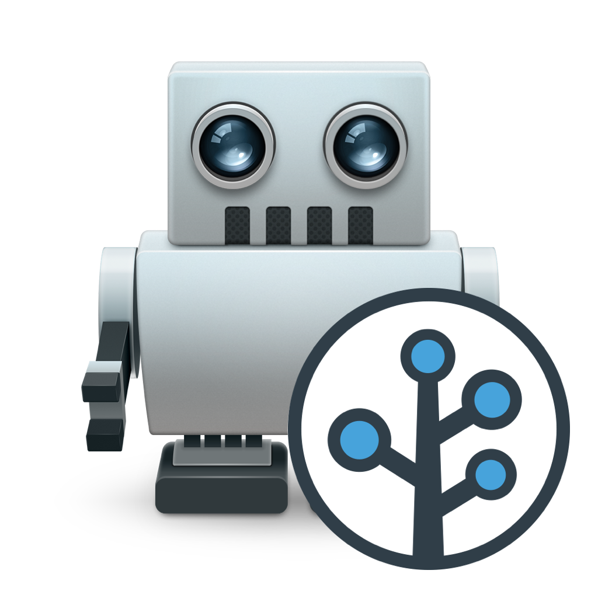
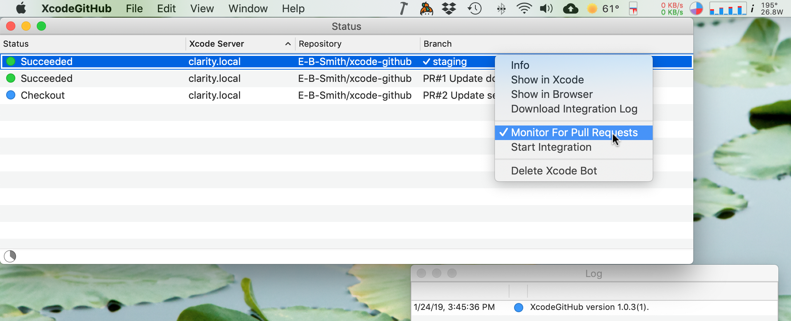
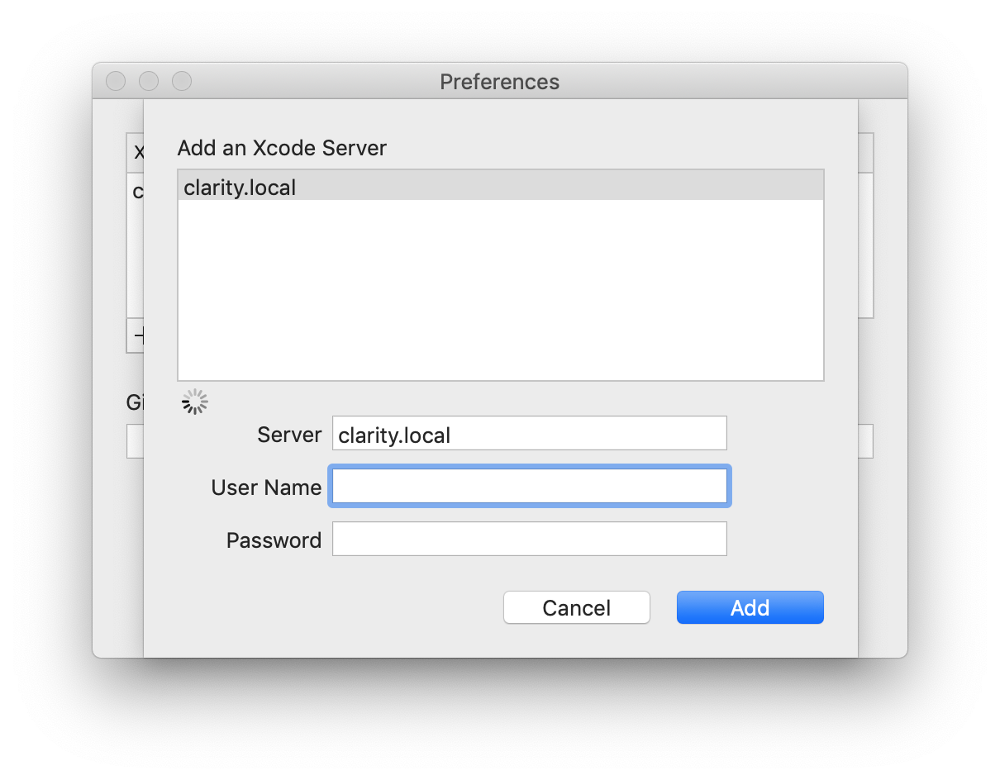
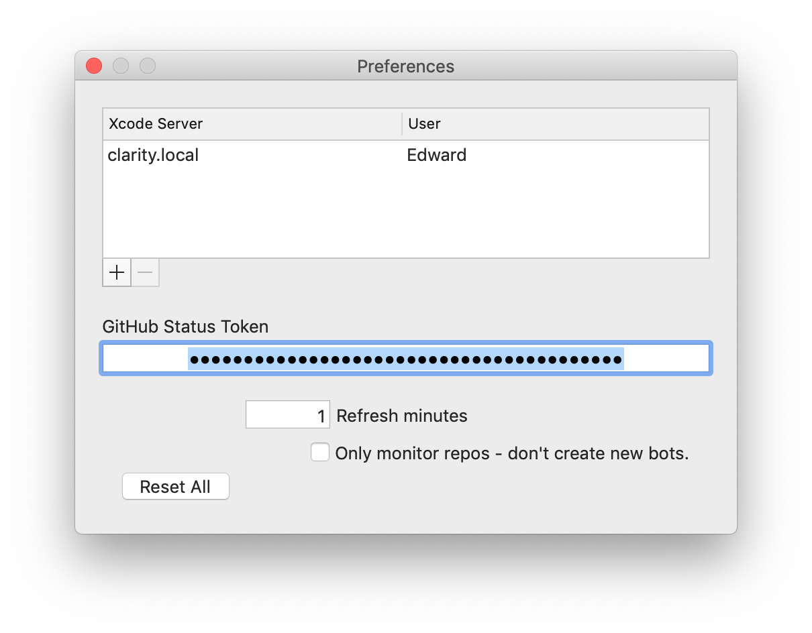
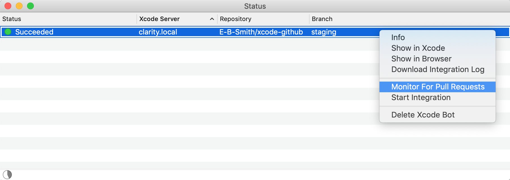
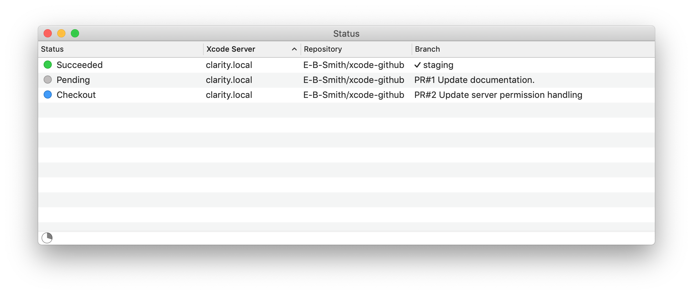

[](https://raw.githubusercontent.com/hyperium/hyper/master/LICENSE)


# xcode-github

<p align="center">

</p>

### Automate your Xcode test and build process with the XcodeGitHub app

Quickly automate your test and build process with XcodeGitHub, a macOS app that monitors your GitHub repos for new pull requests and creates Xcode bots that test them.



### Features

* Runs on your own build computer so you can easily do on-device testing with your own phones or Macs.
* Runs inside your network without any firewall changes.
* Easy to configure and run.

### What's Included

* A light weight macOS app with a clean UI that monitors your GitHub repos and creates Xcode test bots for them.
* An optional command line tool that has most of the same functions of the macOS app.
* A static library that has interfaces for working with GitHub repositories and Xcode test bot system.

### Requirements

* Xcode 9 and above to run the bots.
* macOS 10.12 and above to run Xcode.

## Contents

* [Getting Started](#getting-started)
    - [Installation](#installation)
    - [Monitoring Your First Repo](#monitoring-your-first-repo)
    - [The Command Line Tool](#the-command-line-tool)
* [Trouble Shooting &amp; Support](#trouble-shooting--support)
    - [Diagnosing Problems](#diagnosing-problems)
    - [Reporting Issues &amp; Feature Requests](#reporting-issues--feature-requests)
* [Project Goals](#project-goals)
    - [Goal 1: Write a useful test automation tool](#goal-1-write-a-useful-test-automation-tool)
    - [Goal 2: Write a new macOS app](#goal-2-write-a-new-macos-app)
    - [Goal 3: Experiment with using XCTest for macOS / iOS libraries](#goal-3-experiment-with-using-xctest-for-macos--ios-libraries
)

## Getting Started

### Installation

##### The Easy Installation

Download this file: [`Products/XcodeGitHub.app.zip`](Products/XcodeGitHub.app.zip) from the project, unzip it, and move it to your Applications directory. Done. The app is code signed, but you'll have to approve the app in the system dialog that pops up the first time you run the app.

##### The Slightly Harder Installation

Clone this repo, open the `xcode-github-app.xcodeproj` project file in Xcode, and select *Product > Build* to build the project. After the project finishes compiling the app can be found in the Xcode project tree under the 'Products' folder. Right click to show the app in the Finder and move the app to your Applications directory.
 
### Monitoring Your First Repo

XcodeGitHub works by using an existing Xcode test bot you've already set up as a template for the new bots it creates for the pull requests on your GitHub repo.

You'll have to set up a build/test computer with Xcode, enable Xcode server, and then create a template test bot to get started.

#### 1. Set Up an Xcode Bot Server

Here are some guides for setting Xcode server and configuring bots:

[Xcode Help: Continuous Integration Overview](https://help.apple.com/xcode/mac/10.1/index.html?localePath=en.lproj#/dev466720061)
<br>
[How to use Xcode server in Xcode 9](https://medium.com/bobo-shone/how-to-use-xcode-server-in-xcode-9-93d6d2ee128f)

#### 2. Create a Template Test Bot in Xcode

I usually create my template test bot on the `staging` or `master` branch of my repo and configure the bot exactly as I want the PRs to be tested.

[Xcode Help: Create a bot](https://help.apple.com/xcode/mac/10.1/index.html?localePath=en.lproj#/devc4a08a3ef)

#### 3. Create a GitHub Access Token

Xcode-GitHub updates the status of the PR at GitHub with the result of the tests. 

For the Xcode-GitHub to update the status, create an access token on the GitHub web site by navigating to your *Setting > Developer Settings > Personal Access Tokens* and creating a token with **repo** access. 

*Pro tip:* I created a special GitHub account just for my test bots to limit any security exposure.

[GitHub: Personal access tokens](https://github.com/settings/tokens)

#### 4. Run Xcode-GitHub

The first time you run Xcode-GitHub it will prompt you to add an Xcode server to monitor.

Also enter the user name and password to access the Xcode server. The user name and password are stored securely in the Mac keychain.

You can leave these fields blank if a user name and password aren't required to access your Xcode server.



Next, add your GitHub access token in the Preferences window.

Again, the GitHub access token is stored securely in the Mac keychain.



Finally, in the status window you'll see the test bot you set up previously. Select the bot, right click on it, and select 'Monitor Repo'.



New test bots will be created for your PRs:



That's it! 

Keep the Xcode-GitHub app running so that it can continue monitoring your repos.

### The Command Line Tool

There's also an optional command line tool included that has most of the same functionality as the macOS app. It that can be handy for scripted builds.

The tool is built with the `xcode-github-cli.xcodeproj` project. For your convenience the pre-compiled tool downloaded from [`Products/xcode-github.`](Products/xcode-github)

```
xcode-github - Creates Xcode test bots for new GitHub PRs.

usage: xcode-github [-dhsVv] -g <github-auth-token>
                 -t <bot-template> -x <xcode-server-domain-name>


  -d, --dryrun
      Dry run. Print what would be done.

  -g, --github <github-auth-token>
      A GitHub auth token that allows checking the status of a repo
      and change a PR's status.

  -h, --help
      Print this help information.

  -p, --password <password>
      Password for the Xcode server.

  -r, --repeat
      Repeat updating the status forever, waiting 60 seconds between updates.

  -s, --status
      Only print the status of the Xcode server bots and quit.

  -t --template <bot-template>
      An existing bot on the Xcode server that is used as a template
      for the new GitHub PR bots.

  -u, --user <user>
      User for the Xcode server.

  -V, --version
      Show version and exit.

  -v, --verbose
      Verbose. Extra 'v' increases the verbosity.

  -x, --xcodeserver <xcode-server-domain-name>
      The network name of the Xcode server.
      
The tool returns 0 on success, otherwise a non-zero value.
```

## Trouble Shooting &amp; Support

### Diagnosing Problems

If you're having problems the first diagnostic step is to open the log window (under the 'Window' menu) and look for any issues there. Toggling 'Show debug messages' on the lower right will show more verbose logging.

### Reporting Issues &amp; Feature Requests

Report issues and make suggestions [here, at the issue section of this repository on GitHub.](https://github.com/E-B-Smith/xcode-github/issues) 

## Project Goals

I had several goals for the project when I started. First, I needed an automated way to build and test software on a local computer with specific test devices attached. I couldn't find anything that fit my needs, so I this seemed like a good opportunity to explore some other things I'd been thinking about, such as writing a new macOS app to see how the landscape has changed during the years I had been concentrating on iOS development. Finally I wanted to try some different ways of testing libraries with the Xcode XCTest environment.

### Goal 1: Write a useful test automation tool

While working at Branch Metrics I needed a way to automate the build and test process for our SDKs and other projects. Because of the nature of our SDK it had to be tested on real devices since the simulators just don't have all the features and quirks of an actual device.

For a while I used [Buildasaur](https://github.com/buildasaurs/Buildasaur) for automating tests and builds, a great app that just chugged along until Xcode 9, when the two became incompatible. I considered updating Buildasaur, but it was written in Swift 2.3 and I just didn't want to spend the effort converting the code to Swift 4 and then updating all the Xcode server parts.

It was much easier to start over and write a light weight app in Objective-C which is more stable than Swift, is pretty fast to write, and has the option create static and dynamic libraries.

As a shout out to Buildasaur I used much of the charming messaging it used for the PR statuses that are shown in GitHub.

### Goal 2: Write a new macOS app

I've been writing iOS code almost exclusively for a number of years and I wanted to see how macOS has been evolving. 

The first thing that stood out is that AppKit, the Mac UI library, hasn't been getting the same amount of love as iOS has and feels neglected. 

There's a lot of old NextStep ways of doing things in AppKit, and I mean really old, and it shows. This isn't going away any time soon because it'll break too much stuff, but it could be handled better.

For instance, user interface cells made a lot of sense in the 90s when memory and computing power where absolutely constrained compared to today. But now their purpose isn't clear and they get in the way.

Some things have been updated, like `NSTableView`, which can now be view-based or cell-based.

On the other hand I really appreciated again how feature rich macOS and the development environment is. Native apps are kind of on their way out which is kind of too bad, since native apps have the potential to be very powerful and expressive, and the developement environment is generally pretty good.

### Goal 3: Experiment with using XCTest for macOS / iOS libraries

At Branch we distribute iOS, tvOS, and macOS SDK libraries that are widely used and have to be tested and correct. Further, many developers want to run the Branch SDK tests as part of their testing. 

I wanted to figure out how to modularize XCTest bundles so that they could be included in other project's test suites.

What I envisioned was creating XCTest bundles that could be shipped with a library and included in the main project test suite. They could be dropped in and would automatically run.

I never figured out a great way to do this. 

I tried different combinations of complicated build configurations using xcconfig files that set the `TEST_HOST` and other flags. But the solutions were fragile and required un-intuitive set up. Worse, the working solutions I found increasing got further from the original goal of simple drag-and-drop testing. 

I'd love to hear other people's thoughts on this. Ultimately Xcode testing is just not built to do this, so any solution is simply fighting Xcode.
